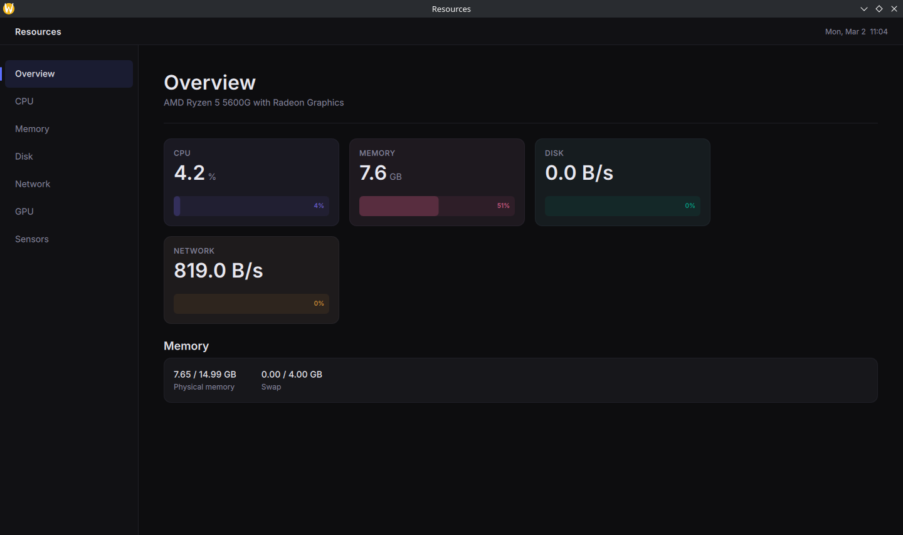

# Resources

A high-performance, modern system monitor built with C++20 and Qt 6.

[](CHANGELOG.md)
[](CHANGELOG.md)
[](LICENSE)



## Features

- **CPU Monitoring**: Real-time per-core usage and model information.
- **Memory & Swap**: Detailed memory breakdown with historical usage graphs.
- **Disk I/O**: Read/Write throughput monitoring per device.
- **Network Stats**: Receive/Transmit speed monitoring per interface (Mbps).
- **Sensors**: Clean thermal reporting from `hwmon` and `thermal_zone`.
- **Modern UI**: Dark mode, glassmorphism-inspired design with Inter typography.

## Requirements

- Linux (Support for `/proc` and `/sys` interfaces)
- Qt 6.x (Core, Quick, Svg, QuickControls2)
- C++20 compatible compiler (Clang/GCC)
- CMake 3.16+

## Building

```bash
mkdir build && cd build
cmake ..
make
./resources
```
